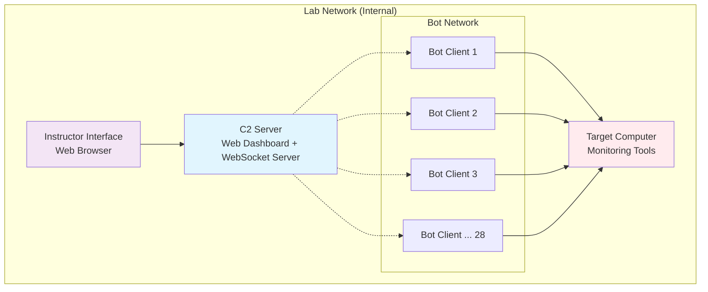

# Design Document

## Overview

The DDoS Simulation Lab is designed as a distributed system with three main components: a Command & Control (C2) server, multiple bot clients, and a target system. The architecture emphasizes safety, educational value, and ease of deployment in a controlled lab environment.

The system uses a client-server architecture where bot clients connect to a central C2 server via WebSocket connections for real-time command distribution. The C2 server provides a web-based dashboard for instructors to control and monitor the simulation.

## Architecture



## Components and Interfaces

### C2 Server Component

**Technology Stack:**
- **Backend**: Python with FastAPI for REST API and WebSocket support
- **Frontend**: HTML/CSS/JavaScript with Chart.js for real-time visualization
- **Database**: SQLite for logging and configuration storage

**Key Interfaces:**
- WebSocket endpoint `/ws/bot` for bot client connections
- REST API `/api/attack` for attack configuration
- Web dashboard at `/dashboard` for instructor control
- Logging interface `/api/logs` for session analysis

**Core Functions:**
- Bot registration and heartbeat monitoring
- Attack command distribution via WebSocket
- Real-time statistics aggregation
- Safety threshold enforcement
- Session logging and replay

### Bot Client Component

**Technology Stack:**
- **Runtime**: Python with asyncio for concurrent connections
- **HTTP Client**: aiohttp for HTTP flood attacks
- **Network**: Raw sockets for TCP/UDP flood attacks
- **Deployment**: Shell script with automatic dependency installation

**Key Interfaces:**
- WebSocket client connecting to C2 server
- Configurable attack modules (HTTP, TCP SYN, UDP)
- System resource monitoring
- Network interface detection for safety checks

**Core Functions:**
- Automatic C2 server discovery and connection
- Attack traffic generation with rate limiting
- Resource usage monitoring and reporting
- Graceful shutdown and cleanup

### Target System Component

**Technology Stack:**
- **Web Server**: Nginx or Apache for HTTP attack targets
- **Monitoring**: htop, iotop, netstat for resource monitoring
- **Logging**: System logs and custom attack detection

**Key Interfaces:**
- HTTP service endpoints for attack targets
- TCP/UDP services for protocol-specific attacks
- Monitoring dashboard for resource visualization
- Log aggregation for attack analysis

## Data Models

### Bot Registration Model
```python
class BotClient:
    bot_id: str
    ip_address: str
    hostname: str
    connection_time: datetime
    last_heartbeat: datetime
    status: BotStatus  # CONNECTED, ATTACKING, DISCONNECTED
    capabilities: List[AttackType]
    current_load: float
```

### Attack Configuration Model
```python
class AttackConfig:
    attack_id: str
    attack_type: AttackType  # HTTP_FLOOD, TCP_SYN, UDP_FLOOD
    target_ip: str
    target_port: int
    intensity: int  # requests per second per bot
    duration: int  # seconds, 0 for indefinite
    safety_limits: SafetyConfig
    active_bots: List[str]
```

### Session Logging Model
```python
class AttackSession:
    session_id: str
    start_time: datetime
    end_time: datetime
    attack_config: AttackConfig
    participating_bots: List[BotClient]
    metrics: SessionMetrics
    logs: List[LogEntry]
```

## Error Handling

### Network Resilience
- **Bot Disconnection**: C2 server maintains active bot list with heartbeat monitoring
- **Connection Retry**: Bots implement exponential backoff for reconnection attempts
- **Partial Failures**: System continues operating with reduced bot count
- **Network Partitioning**: Bots detect network isolation and attempt reconnection

### Safety Mechanisms
- **Network Boundary Checking**: All components verify operations within lab network range
- **Resource Monitoring**: Automatic throttling when system resources exceed thresholds
- **Emergency Stop**: Immediate attack cessation via broadcast command
- **Rate Limiting**: Per-bot traffic limits to prevent system overload

### Error Recovery
- **Configuration Validation**: Input sanitization and validation before attack execution
- **Graceful Degradation**: System functionality reduction rather than complete failure
- **Automatic Cleanup**: Resource cleanup on abnormal termination
- **Logging and Alerting**: Comprehensive error logging for troubleshooting

## Testing Strategy

### Unit Testing
- **C2 Server**: Test WebSocket handling, attack coordination, safety limits
- **Bot Client**: Test connection management, attack modules, resource monitoring
- **Attack Modules**: Validate traffic generation patterns and rate limiting
- **Safety Systems**: Verify network boundary checks and emergency stops

### Integration Testing
- **End-to-End Scenarios**: Full attack simulation with multiple bots
- **Network Resilience**: Bot disconnection and reconnection scenarios
- **Safety Validation**: Threshold enforcement and emergency stop functionality
- **Performance Testing**: System behavior under maximum bot load

### Educational Testing
- **Instructor Workflow**: Dashboard usability and control responsiveness
- **Student Observation**: Monitoring interface clarity and real-time updates
- **Scenario Variety**: Different attack types and intensity levels
- **Learning Outcomes**: Verification that educational objectives are met

### Security Testing
- **Network Containment**: Verification that attacks remain within lab network
- **Access Control**: Ensure only authorized users can control the simulation
- **Data Protection**: Secure handling of logs and session data
- **System Hardening**: Protection against misuse or unauthorized access

## Deployment Architecture

### Automated Bot Deployment
```bash
# Deployment script structure
1. Network discovery and validation
2. SSH key distribution for automated access
3. Dependency installation (Python, required packages)
4. Bot client configuration and startup
5. C2 server connection verification
```

### Configuration Management
- **Environment Detection**: Automatic Linux distribution and version detection
- **Network Configuration**: Dynamic C2 server IP discovery
- **Resource Allocation**: Automatic performance tuning based on system capabilities
- **Service Management**: Systemd integration for persistent bot services

### Monitoring and Observability
- **Real-time Dashboards**: Live attack statistics and bot status
- **Historical Analysis**: Session replay and performance trends
- **Alert System**: Notifications for system issues or safety violations
- **Educational Metrics**: Learning outcome tracking and assessment tools