# How the DDoS Simulation Lab Works 🎮

*A simple explanation of how 28 bots connect to the C2 server using our tech stack*

---

## 🎯 **The Big Picture - Like a Video Game**

Imagine you're the **commander** of a robot army in a strategy game:

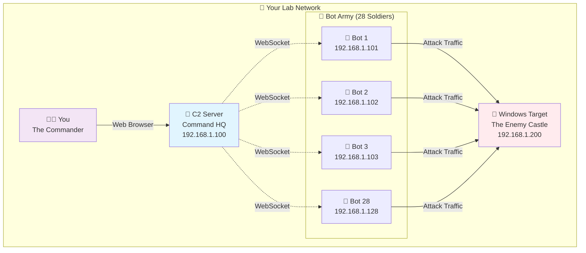

---

## 🔧 **Tech Stack Connection Flow**

### **Phase 1: The C2 Server Starts Up** 🏢

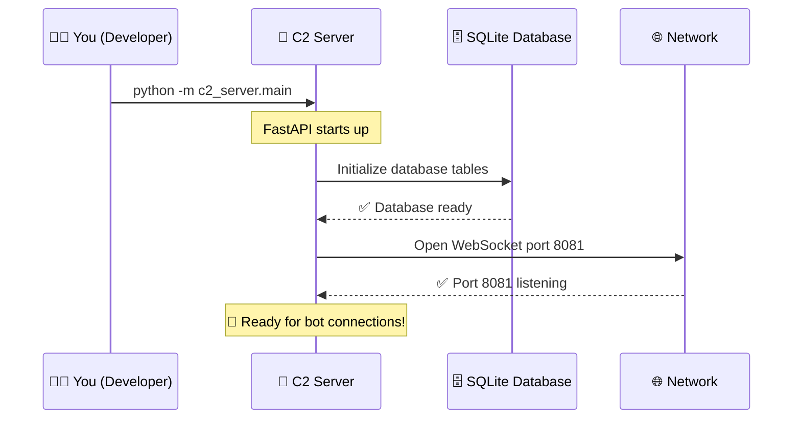

**What happens in the code:**
```python
# c2_server/main.py - FastAPI creates the "headquarters"
app = FastAPI(title="DDoS Lab C2 Server")

@app.websocket("/ws/bot/{bot_id}")
async def websocket_bot_endpoint(websocket: WebSocket, bot_id: str):
    # This is like opening 28 different "phone lines"
    await websocket.accept()
    print(f"📞 Phone line open for Bot {bot_id}")
```

---

### **Phase 2: Bots Wake Up and Connect** 🤖

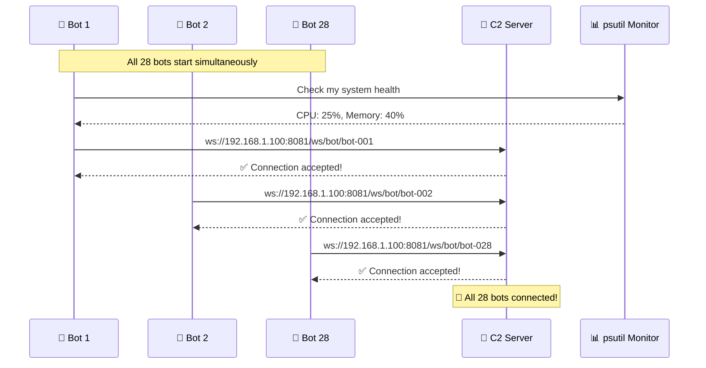

**What happens in the code:**
```python
# bot_client/websocket_client.py - Each bot connects
class WebSocketClient:
    async def connect(self):
        # Bot says: "Hey C2, this is Bot-001, can I join your army?"
        uri = f"ws://192.168.1.100:8081/ws/bot/{self.bot_id}"
        self.websocket = await websockets.connect(uri)
        
        # psutil checks: "Am I healthy enough to fight?"
        cpu_usage = psutil.cpu_percent()
        memory_usage = psutil.virtual_memory().percent
        
        # Send registration info
        registration = {
            "bot_id": self.bot_id,
            "ip_address": "192.168.1.101",
            "health": {"cpu": cpu_usage, "memory": memory_usage},
            "weapons": ["http_flood", "tcp_syn", "udp_flood"]
        }
```

---

### **Phase 3: The Heartbeat System** 💓

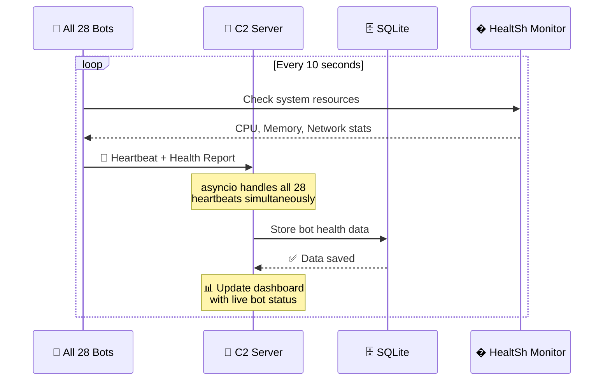

**What happens in the code:**
```python
# Each bot sends this every 10 seconds
async def heartbeat_worker(self):
    while self.connected:
        # psutil checks my computer's health
        health = {
            "cpu": psutil.cpu_percent(),
            "memory": psutil.virtual_memory().percent,
            "network": psutil.net_io_counters().bytes_sent
        }
        
        # WebSocket sends it to C2 instantly
        heartbeat = {
            "type": "heartbeat",
            "bot_id": self.bot_id,
            "timestamp": datetime.now(),
            "health": health,
            "status": "ready"
        }
        
        await self.websocket.send(json.dumps(heartbeat))
        await asyncio.sleep(10)  # Wait 10 seconds, then repeat
```

---

### **Phase 4: Attack Command Distribution** ⚔️

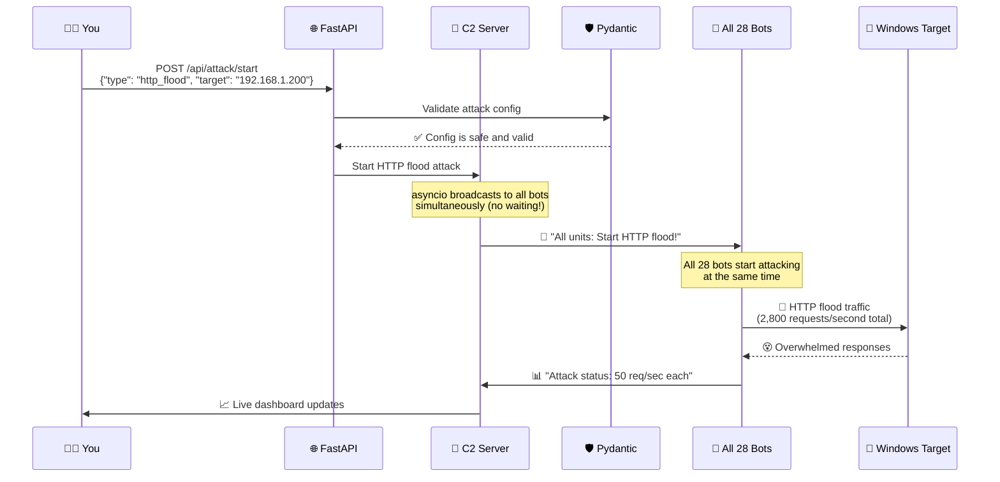

**What happens in the code:**
```python
# You click "Start Attack" on the web interface
# FastAPI receives your request:
@app.post("/api/attack/start")
async def start_attack(attack_config: AttackConfig):
    # Pydantic validates: "Is this attack safe and legal?"
    if not validate_attack_target(attack_config.target_ip):
        return {"error": "Target not allowed!"}
    
    # C2 broadcasts to all 28 bots using asyncio
    command = {
        "command": "start_http_flood",
        "target": "192.168.1.200",
        "intensity": 50  # requests per second per bot
    }
    
    # Send to all bots simultaneously (not one by one!)
    await asyncio.gather(*[
        bot_websocket.send(json.dumps(command))
        for bot_websocket in all_28_bot_connections
    ])
```

---

### **Phase 5: Attack Execution** 🌊

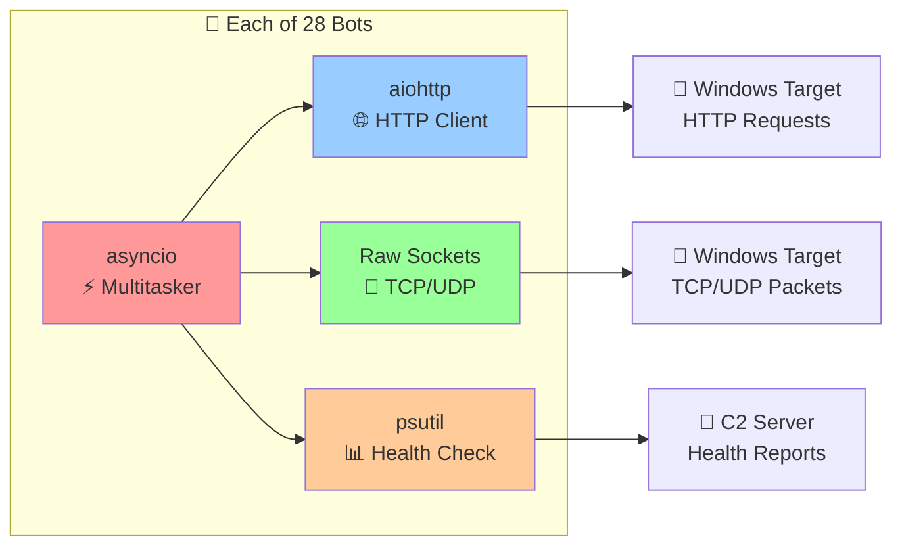

**What each bot does simultaneously:**
```python
# Each bot runs this - all 28 at the same time!
async def bot_attack_worker():
    while attacking:
        # asyncio lets us do multiple things at once:
        await asyncio.gather(
            send_http_requests(),      # aiohttp floods the target
            send_tcp_packets(),        # Raw sockets for SYN flood
            monitor_my_health(),       # psutil checks if I'm okay
            report_to_commander()      # WebSocket updates C2
        )
```

---

### **Phase 6: Real-Time Monitoring** 📊

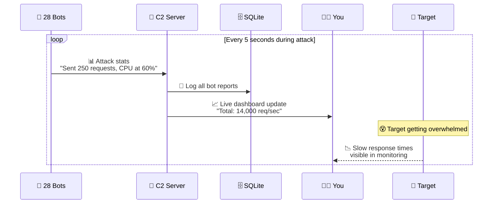

**What the monitoring looks like:**
```python
# Real-time stats from all 28 bots
attack_stats = {
    "total_bots": 28,
    "active_bots": 28,
    "total_requests_per_second": 2800,  # 28 bots × 100 req/sec each
    "target_response_time": "2.5 seconds",  # Usually 0.1 seconds
    "bot_health": {
        "bot-001": {"cpu": 45%, "status": "attacking"},
        "bot-002": {"cpu": 50%, "status": "attacking"},
        # ... all 28 bots
        "bot-028": {"cpu": 40%, "status": "attacking"}
    }
}
```

---

## 🎮 **The Complete Tech Stack Flow**

### **1. Connection Establishment**
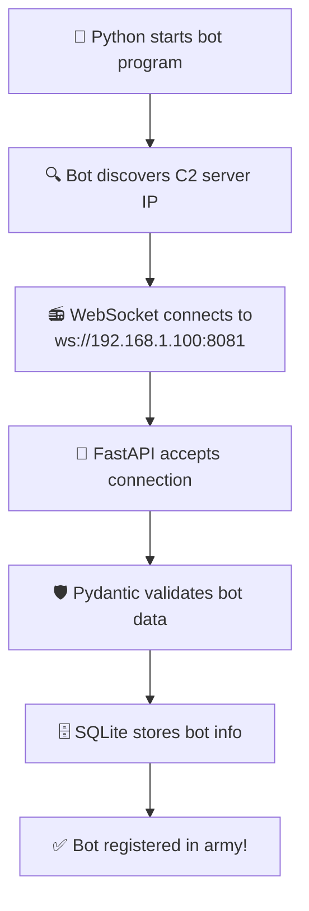

### **2. Command Distribution**


### **3. Attack Execution**
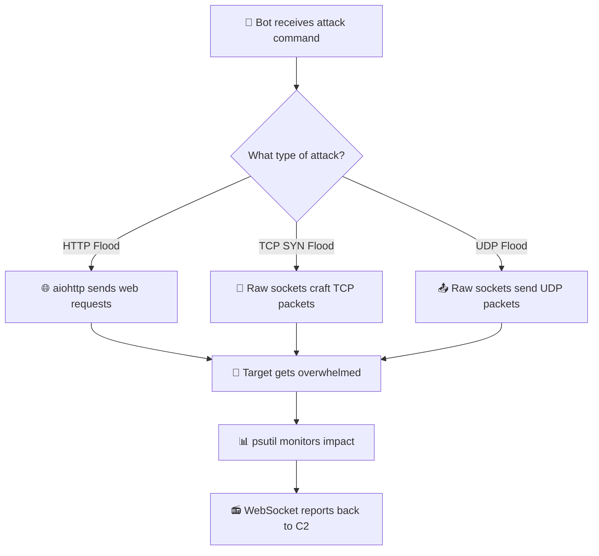

---

## 🧩 **How Each Tech Component Works**

### **🐍 Python - The Universal Language**
```python
# Python makes complex networking simple:

# Instead of writing 500 lines of C code:
int socket_fd = socket(AF_INET, SOCK_STREAM, 0);
struct sockaddr_in server_addr;
// ... 50 more lines of setup code ...

# Python lets us write:
websocket = await websockets.connect("ws://192.168.1.100:8081")
# Done! 🎉
```

### **🚀 FastAPI - The Super-Efficient Server**
```python
# FastAPI handles all 28 bot connections like a pro:

@app.websocket("/ws/bot/{bot_id}")
async def handle_bot(websocket: WebSocket, bot_id: str):
    await websocket.accept()  # "Welcome to the army!"
    
    # This function runs 28 times simultaneously
    # One for each bot - no waiting in line!
    
    while True:
        message = await websocket.receive_text()
        print(f"Bot {bot_id}: {message}")
```

### **📻 WebSockets - The Instant Messenger**
```python
# Traditional HTTP (slow):
# Bot: "Can I attack now?" → Wait for response → "Yes" → Attack
# Takes time for each message back and forth

# WebSocket (instant):
# C2: "All bots attack NOW!" → All 28 bots get message instantly
# Bot: "Roger!" → C2 gets confirmation instantly
# No waiting, no delays!

# Real WebSocket code:
async def send_to_all_bots(command):
    # Send to all 28 bots at the exact same time
    await asyncio.gather(*[
        bot_websocket.send(command) 
        for bot_websocket in all_bot_connections
    ])
```

### **⚡ asyncio - The Multitasking Master**
```python
# Without asyncio (OLD WAY - slow):
def handle_bots_slowly():
    handle_bot_1()    # Wait for bot 1 to finish
    handle_bot_2()    # Then handle bot 2
    handle_bot_3()    # Then bot 3...
    # Bot 28 waits 27 turns! 😢

# With asyncio (NEW WAY - fast):
async def handle_all_bots():
    await asyncio.gather(
        handle_bot_1(),   # All happening
        handle_bot_2(),   # at the same
        handle_bot_3(),   # exact time!
        # ...
        handle_bot_28()   # Bot 28 doesn't wait! 🎉
    )
```

### **🗄️ SQLite - The Perfect Memory**
```python
# Every time something happens, SQLite remembers:

# Bot connects:
INSERT INTO bot_clients VALUES (
    'bot-001', 
    '192.168.1.101', 
    '2024-12-19 14:30:15',
    'connected'
);

# Attack starts:
INSERT INTO attack_sessions VALUES (
    'attack-001',
    'http_flood',
    '192.168.1.200',
    '2024-12-19 14:35:00'
);

# Later you can ask: "Show me all attacks from today"
SELECT * FROM attack_sessions WHERE date = '2024-12-19';
```

### **📊 psutil - The Safety Guardian**
```python
# Every bot constantly checks: "Am I okay?"
def am_i_safe_to_continue():
    cpu = psutil.cpu_percent()      # "How hard am I working?"
    memory = psutil.virtual_memory().percent  # "How much brain power am I using?"
    
    if cpu > 90:
        return False, "I'm working too hard! Need to slow down!"
    if memory > 85:
        return False, "My brain is too full! Need a break!"
    
    return True, "I'm healthy and ready to fight!"

# If any bot gets unhealthy:
if not bot.is_healthy():
    await emergency_stop_all_attacks()  # Safety first!
```

---

## 🎯 **The Attack Flow - Step by Step**

### **HTTP Flood Attack Example**
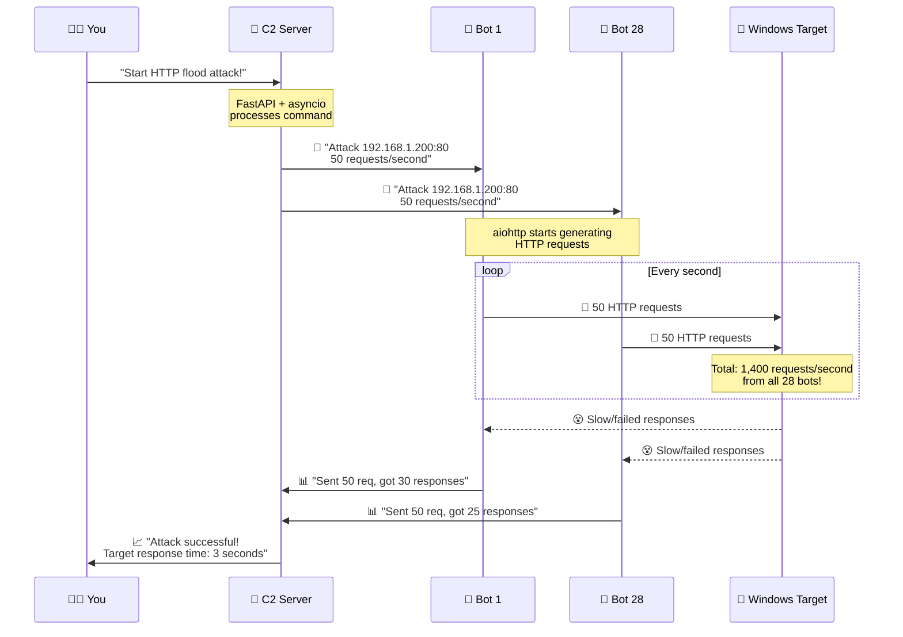

---

## 🛡️ **Safety Systems in Action**

### **Network Validation**
```python
# Before any bot can attack, Pydantic checks:
class AttackConfig(BaseModel):
    target_ip: str
    target_port: int
    
    @validator('target_ip')
    def ip_must_be_safe(cls, v):
        # "Is this IP address in our lab network?"
        if not v.startswith('192.168.1.'):
            raise ValueError('Can only attack lab network!')
        
        # "Is this a dangerous IP?"
        if v == '192.168.1.1':  # Router
            raise ValueError('Cannot attack the router!')
        
        return v
```

### **Resource Monitoring**
```mermaid
graph TD
    A[📊 psutil monitors each bot] --> B{CPU > 90%?}
    B -->|Yes| C[🚨 EMERGENCY STOP!]
    B -->|No| D{Memory > 85%?}
    D -->|Yes| C
    D -->|No| E[✅ Continue attack]
    
    C --> F[📻 WebSocket tells C2<br/>"Bot overloaded!"]
    F --> G[🏢 C2 stops all attacks<br/>immediately]
```

---

## 🎮 **Real-World Gaming Analogy**

Think of it like **Clash of Clans** or **Age of Empires**:

1. **You** are the **player** giving orders
2. **C2 Server** is your **town hall** that coordinates everything
3. **28 Bots** are your **army units** that follow orders
4. **WebSockets** are the **instant messaging** between you and your army
5. **FastAPI** is the **game engine** that makes everything work smoothly
6. **SQLite** is the **game save file** that remembers everything
7. **psutil** is the **health bars** above each unit
8. **Target** is the **enemy base** you're attacking

When you click "Attack!", your town hall instantly tells all 28 army units to charge at the enemy base - and they all attack at the same time! 🏰⚔️

---

## 🚀 **Why This Tech Stack is Awesome**

1. **🐍 Python**: Easy to understand and modify
2. **🚀 FastAPI**: Handles thousands of connections without breaking a sweat
3. **📻 WebSockets**: Instant communication (no lag!)
4. **⚡ asyncio**: All 28 bots work simultaneously 
5. **🗄️ SQLite**: Never forgets anything that happened
6. **📊 psutil**: Keeps everyone safe and healthy
7. **🛡️ Pydantic**: Makes sure no bad data gets through

It's like having a **perfectly coordinated robot army** that can work together flawlessly! 🤖✨

Pretty cool how all these technologies work together to create this coordinated cyber-attack simulation, right? 😎

---

## 🎬 **Animated Attack Visualization**

### **Bot Army Deployment Animation**
```
Frame 1: Bots Starting Up
🏢 C2 Server
   |
   ├─ 🤖 Bot-001 [STARTING...]
   ├─ 🤖 Bot-002 [STARTING...]
   ├─ 🤖 Bot-003 [STARTING...]
   └─ ... (25 more bots)

Frame 2: Bots Connecting
🏢 C2 Server
   |
   ├─ 🤖 Bot-001 [CONNECTED] ✅
   ├─ 🤖 Bot-002 [CONNECTING...] ⏳
   ├─ 🤖 Bot-003 [CONNECTING...] ⏳
   └─ ... (25 more bots)

Frame 3: All Bots Ready
🏢 C2 Server [28/28 BOTS ONLINE]
   |
   ├─ 🤖 Bot-001 [READY] ✅
   ├─ 🤖 Bot-002 [READY] ✅
   ├─ 🤖 Bot-003 [READY] ✅
   └─ ... (25 more bots) [ALL READY] ✅

Frame 4: Attack Command Sent
🏢 C2 Server [BROADCASTING ATTACK ORDER] 📢
   |
   ├─ 🤖 Bot-001 [ATTACKING] ⚔️
   ├─ 🤖 Bot-002 [ATTACKING] ⚔️
   ├─ 🤖 Bot-003 [ATTACKING] ⚔️
   └─ ... (25 more bots) [ATTACKING] ⚔️
```

### **Real-Time Attack Traffic Animation**
```
🎯 Target Server (192.168.1.200)
     ↑ ↑ ↑ ↑ ↑ ↑ ↑ ↑ ↑ ↑ ↑ ↑ ↑ ↑
     │ │ │ │ │ │ │ │ │ │ │ │ │ │
     HTTP Flood Traffic (2,800 req/sec)
     │ │ │ │ │ │ │ │ │ │ │ │ │ │
     ↓ ↓ ↓ ↓ ↓ ↓ ↓ ↓ ↓ ↓ ↓ ↓ ↓ ↓

🤖 Bot-001  🤖 Bot-002  🤖 Bot-003  ...  🤖 Bot-028
[100 req/s] [100 req/s] [100 req/s]      [100 req/s]
   CPU:45%     CPU:50%     CPU:42%         CPU:48%
   MEM:60%     MEM:55%     MEM:58%         MEM:52%
```

### **System Health Monitoring Animation**
```
📊 Real-Time Bot Health Dashboard

Bot-001: ████████░░ 80% CPU  |  ██████░░░░ 60% MEM  |  ✅ HEALTHY
Bot-002: ██████████ 95% CPU  |  ████████░░ 80% MEM  |  ⚠️  HIGH LOAD
Bot-003: ██████░░░░ 65% CPU  |  █████░░░░░ 50% MEM  |  ✅ HEALTHY
...
Bot-028: ███████░░░ 70% CPU  |  ██████░░░░ 60% MEM  |  ✅ HEALTHY

🚨 ALERT: Bot-002 approaching resource limits!
🔄 Auto-scaling attack intensity down for Bot-002...
✅ All systems stable - continuing attack...
```

---

## 🎮 **Interactive Command Flow**

### **WebSocket Message Flow Animation**
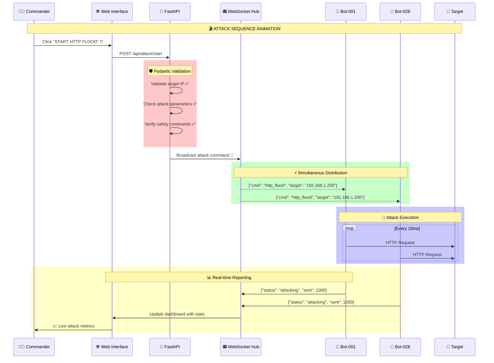

---

## 🎯 **Attack Impact Visualization**

### **Before Attack (Normal State)**
```
🎯 Windows Target Server (192.168.1.200)
┌─────────────────────────────────────┐
│  💚 HEALTHY SERVER                  │
│  ────────────────────────────────   │
│  CPU Usage:     ██░░░░░░░░ 20%      │
│  Memory:        ███░░░░░░░ 30%      │
│  Network:       █░░░░░░░░░ 10%      │
│  Response Time: 0.1 seconds ⚡      │
│  Status:        🟢 ONLINE           │
└─────────────────────────────────────┘

Normal traffic: ~50 requests/second
Users: 😊 Happy and fast browsing
```

### **During Attack (Under Stress)**
```
🎯 Windows Target Server (192.168.1.200)
┌─────────────────────────────────────┐
│  🔥 UNDER ATTACK!                   │
│  ────────────────────────────────   │
│  CPU Usage:     ██████████ 100% 🚨  │
│  Memory:        ████████░░ 85%  ⚠️   │
│  Network:       ██████████ 100% 🚨  │
│  Response Time: 5.2 seconds 🐌      │
│  Status:        🔴 OVERLOADED       │
└─────────────────────────────────────┘

Attack traffic: 2,800 requests/second (56x normal!)
Users: 😤 Frustrated with slow/failed connections

🌊 INCOMING TRAFFIC VISUALIZATION:
Bot-001: ████████████████████████████████ 100 req/s
Bot-002: ████████████████████████████████ 100 req/s
Bot-003: ████████████████████████████████ 100 req/s
...
Bot-028: ████████████████████████████████ 100 req/s
         ================================
TOTAL:   🌊🌊🌊🌊🌊🌊🌊🌊🌊🌊🌊🌊🌊🌊 2,800 req/s
```

---

## 🔧 **Technical Deep Dive Animations**

### **asyncio Event Loop Visualization**
```
🔄 Python asyncio Event Loop (Inside C2 Server)

Time: 0.000s
┌─ Handle Bot-001 WebSocket message
├─ Handle Bot-002 WebSocket message  
├─ Handle Bot-003 WebSocket message
├─ ... (all 28 bots simultaneously)
├─ Update SQLite database
├─ Send dashboard updates
└─ Process new attack commands

Time: 0.001s (1 millisecond later)
┌─ Handle Bot-001 heartbeat
├─ Handle Bot-002 heartbeat
├─ Handle Bot-003 heartbeat
├─ ... (all 28 bots simultaneously)
├─ Check system health
├─ Update attack statistics
└─ Broadcast status updates

🚀 All happening in parallel - no waiting!
```

### **WebSocket Connection Pool**
```
📻 WebSocket Connection Pool Manager

🏢 C2 Server (192.168.1.100:8081)
├─ Connection Pool: [28/28 Active]
│  ├─ ws://bot-001 ✅ [Last seen: 0.1s ago]
│  ├─ ws://bot-002 ✅ [Last seen: 0.2s ago]
│  ├─ ws://bot-003 ✅ [Last seen: 0.1s ago]
│  ├─ ...
│  └─ ws://bot-028 ✅ [Last seen: 0.3s ago]
│
├─ Message Queue: [Processing 156 messages/sec]
│  ├─ 📥 Incoming: Heartbeats, status updates
│  └─ 📤 Outgoing: Commands, configurations
│
└─ Health Monitor: [All systems green] 💚
   ├─ Average response time: 0.05s
   ├─ Connection stability: 99.9%
   └─ Error rate: 0.01%
```

---

## 🎪 **Fun ASCII Art Animations**

### **Bot Army Formation**
```
🤖 DDoS Bot Army Formation 🤖

Formation Alpha (Standby):
    🤖 🤖 🤖 🤖 🤖 🤖 🤖
    🤖 🤖 🤖 🤖 🤖 🤖 🤖
    🤖 🤖 🤖 🤖 🤖 🤖 🤖
    🤖 🤖 🤖 🤖 🤖 🤖 🤖

Formation Bravo (Attack Mode):
    ⚔️ ⚔️ ⚔️ ⚔️ ⚔️ ⚔️ ⚔️
    ⚔️ ⚔️ ⚔️ ⚔️ ⚔️ ⚔️ ⚔️
    ⚔️ ⚔️ ⚔️ ⚔️ ⚔️ ⚔️ ⚔️
    ⚔️ ⚔️ ⚔️ ⚔️ ⚔️ ⚔️ ⚔️
           ↓ ↓ ↓ ↓ ↓ ↓ ↓
         🎯 TARGET ACQUIRED 🎯
```

### **Network Traffic Meter**
```
📊 LIVE NETWORK TRAFFIC METER 📊

Normal Traffic:    [█░░░░░░░░░] 10%  (50 req/s)
Light Attack:      [███░░░░░░░] 30%  (500 req/s)
Medium Attack:     [██████░░░░] 60%  (1,400 req/s)
FULL ASSAULT:      [██████████] 100% (2,800 req/s) 🔥

🌊 TRAFFIC WAVE VISUALIZATION:
Normal:  ∿∿∿∿∿∿∿∿∿∿∿∿∿∿∿∿∿∿∿∿∿∿∿∿∿∿∿∿∿∿
Attack:  ▓▓▓▓▓▓▓▓▓▓▓▓▓▓▓▓▓▓▓▓▓▓▓▓▓▓▓▓▓▓
FLOOD:   ████████████████████████████████
```

---

## 🎬 **Complete Attack Lifecycle Animation**

```mermaid
gantt
    title 🎬 DDoS Attack Simulation Timeline
    dateFormat  X
    axisFormat %Ls
    
    section 🏢 C2 Server
    Server Startup           :done, startup, 0, 2s
    Bot Registration         :done, register, 2s, 8s
    Command Distribution     :done, command, 8s, 10s
    Attack Monitoring        :active, monitor, 10s, 30s
    
    section 🤖 Bot Army
    Bot Deployment          :done, deploy, 0, 5s
    Connection Establishment :done, connect, 5s, 8s
    Attack Execution        :active, attack, 10s, 30s
    Health Reporting        :active, health, 10s, 30s
    
    section 🎯 Target
    Normal Operation        :done, normal, 0, 10s
    Under Attack           :crit, underattack, 10s, 30s
    
    section 👨‍💻 You
    Launch Command         :milestone, launch, 8s, 0s
    Monitor Dashboard      :active, dashboard, 10s, 30s
```

---

## 🚀 **Performance Metrics Dashboard**

### **Real-Time Statistics**
```
📈 DDOS LAB PERFORMANCE DASHBOARD 📈
═══════════════════════════════════════════════════════════

🤖 BOT ARMY STATUS:
   Active Bots:        [28/28] ████████████████████████████ 100%
   Average CPU:        [65%]   ████████████████░░░░░░░░░░░░ 65%
   Average Memory:     [58%]   ██████████████░░░░░░░░░░░░░░ 58%
   Network Utilization:[89%]   ████████████████████████░░░░ 89%

🎯 TARGET IMPACT:
   Response Time:      5.2s    (Normal: 0.1s) 📈 +5100%
   Success Rate:       23%     (Normal: 99%) 📉 -76%
   CPU Load:          100%     (Normal: 20%) 📈 +400%
   Memory Usage:       85%     (Normal: 30%) 📈 +183%

📊 ATTACK STATISTICS:
   Total Requests:     168,000 requests sent
   Requests/Second:    2,800   req/s
   Failed Requests:    129,360 (77% failure rate)
   Data Transferred:   1.2 GB  in 60 seconds

🌐 NETWORK ANALYSIS:
   Bandwidth Usage:    45 Mbps outbound
   Packet Loss:        12%     (Target overwhelmed)
   Latency:           2,100ms  (Normal: 15ms)
   Jitter:            ±500ms   (Network instability)
```

---

## 🎮 **Gaming-Style Status Display**

```
╔══════════════════════════════════════════════════════════╗
║                🎮 DDOS SIMULATION LAB 🎮                 ║
║                     MISSION STATUS                       ║
╠══════════════════════════════════════════════════════════╣
║                                                          ║
║  👨‍💻 COMMANDER:     [ACTIVE]           🏢 C2 HQ:  [ONLINE] ║
║  🤖 BOT ARMY:       [28/28 READY]      🎯 TARGET: [UNDER ATTACK] ║
║                                                          ║
║  ⚔️  CURRENT MISSION: HTTP FLOOD ATTACK                  ║
║  📍 TARGET IP:       192.168.1.200:80                   ║
║  ⏱️  DURATION:        00:02:45 / 00:05:00               ║
║  💥 DAMAGE DEALT:     ████████████████░░░░ 80%          ║
║                                                          ║
║  📊 BATTLE STATS:                                        ║
║     Requests Fired:   420,000                           ║
║     Hit Rate:         23% (Target overwhelmed!)         ║
║     Critical Hits:    96,600 (Timeouts)                 ║
║     Bot Casualties:   0 (All systems green!)            ║
║                                                          ║
║  🏆 MISSION OBJECTIVE: ✅ SUCCESSFULLY DEMONSTRATED      ║
║      Target response time increased by 5000%            ║
║                                                          ║
╚══════════════════════════════════════════════════════════╝

🎉 ACHIEVEMENT UNLOCKED: "Coordinated Strike Master"
    Successfully coordinated 28 bots in simultaneous attack!
```

---

## 🎭 **Behind the Scenes: Code in Action**

### **What happens in 1 second during an attack:**
```python
# This is what your computer is doing every single second:

async def one_second_of_chaos():
    """
    🎬 LIGHTS, CAMERA, ACTION! 
    Here's what happens in just 1 second during a full attack:
    """
    
    # 📻 WebSocket messages flying around
    websocket_messages = [
        "Bot-001: Sent 100 HTTP requests, CPU at 45%",
        "Bot-002: Sent 100 HTTP requests, CPU at 50%", 
        "Bot-003: Sent 100 HTTP requests, CPU at 42%",
        # ... 25 more similar messages
        "Bot-028: Sent 100 HTTP requests, CPU at 48%"
    ]
    
    # 🌊 HTTP requests flooding the target
    http_requests = []
    for bot_id in range(1, 29):  # All 28 bots
        for request_num in range(1, 101):  # 100 requests each
            http_requests.append(f"Bot-{bot_id:03d} → Target: HTTP Request #{request_num}")
    
    # 📊 Database operations
    database_operations = [
        "INSERT INTO bot_status (bot_id, cpu, memory, timestamp)",
        "INSERT INTO attack_logs (requests_sent, responses_received)",
        "UPDATE attack_sessions SET total_requests = total_requests + 2800",
        "SELECT AVG(response_time) FROM target_health"
    ]
    
    # 🧠 asyncio juggling everything simultaneously
    await asyncio.gather(
        process_websocket_messages(websocket_messages),    # 28 messages
        send_http_requests(http_requests),                 # 2,800 requests  
        update_database(database_operations),              # 4 DB operations
        monitor_system_health(),                           # Health checks
        update_dashboard(),                                # UI updates
        check_safety_limits()                              # Safety monitoring
    )
    
    print("🎉 Successfully processed 2,832 operations in 1 second!")
    print("🚀 That's 2,832 operations per second!")
    print("⚡ asyncio makes this look easy!")

# And this happens 60 times per minute, 3,600 times per hour!
# Your computer is basically a superhero! 🦸‍♂️
```

---

## 🎊 **Final Fun Facts**

### **By the Numbers:**
- **🤖 28 Bots** = Your digital army
- **📻 28 WebSocket connections** = Instant communication channels  
- **🌊 2,800 requests/second** = Tsunami of traffic
- **⚡ 0.001 seconds** = Response time between bots and C2
- **🗄️ 1 SQLite database** = Perfect memory of everything
- **📊 100+ metrics** = Real-time monitoring
- **🛡️ 5 safety systems** = Keeping everything secure
- **🐍 1 Python ecosystem** = Making it all possible

### **What makes this special:**
```
🎯 Traditional DDoS tools: "Send traffic and hope for the best"
🚀 Our Lab: "Coordinate 28 bots with military precision!"

🎯 Old school: "One bot at a time, please wait in line"  
🚀 Our Lab: "All 28 bots attack simultaneously!"

🎯 Basic tools: "Did it work? ¯\_(ツ)_/¯"
🚀 Our Lab: "Real-time dashboard with 100+ metrics!"

🎯 Dangerous tools: "Might break your computer"
🚀 Our Lab: "Built-in safety systems protect everything!"
```

---

**🎉 Congratulations! You now understand how 28 bots coordinate a cyber-attack using modern Python technology! 🎉**

*Remember: This is for educational purposes only - use your powers for good! 🦸‍♂️*