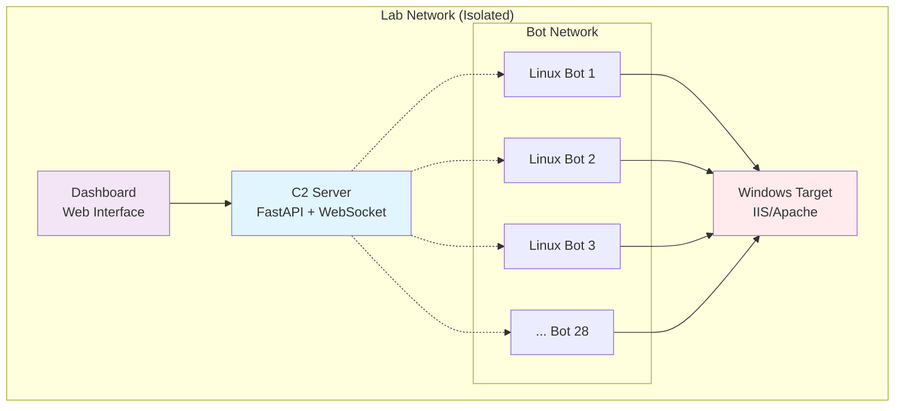

<div align="center">

```
██████╗ ██████╗  ██████╗ ███████╗    ██████╗ ██╗   ██╗    ███╗   ███╗██╗   ██╗██████╗  █████╗ ██╗     ██╗
██╔══██╗██╔══██╗██╔═══██╗██╔════╝    ██╔══██╗╚██╗ ██╔╝    ████╗ ████║██║   ██║██╔══██╗██╔══██╗██║     ██║
██║  ██║██║  ██║██║   ██║███████╗    ██████╔╝ ╚████╔╝     ██╔████╔██║██║   ██║██████╔╝███████║██║     ██║
██║  ██║██║  ██║██║   ██║╚════██║    ██╔══██╗  ╚██╔╝      ██║╚██╔╝██║██║   ██║██╔══██╗██╔══██║██║     ██║
██████╔╝██████╔╝╚██████╔╝███████║    ██████╔╝   ██║       ██║ ╚═╝ ██║╚██████╔╝██║  ██║██║  ██║███████╗██║
╚═════╝ ╚═════╝  ╚═════╝ ╚══════╝    ╚═════╝    ╚═╝       ╚═╝     ╚═╝ ╚═════╝ ╚═╝  ╚═╝╚═╝  ╚═╝╚══════╝╚═╝
```

<h1>🛡️ DDoS Simulation Lab 🛡️</h1>
<h3>🎯 Advanced Educational Cybersecurity Framework 🎯</h3>
<h4>💻 Created by <strong>Murali</strong> 💻</h4>

[](https://opensource.org/licenses/MIT)
[](https://www.python.org/downloads/)
[](LICENSE)
[](https://fastapi.tiangolo.com)
[](https://github.com/Murali8823)
[](https://github.com/Murali8823/ddos)

</div>

An advanced educational DDoS simulation framework designed for cybersecurity training in controlled laboratory environments. This project provides hands-on experience with distributed denial-of-service attacks, network security concepts, and defensive strategies.

## 🎯 Overview

The DDoS Simulation Lab is a comprehensive educational platform that simulates realistic DDoS attacks in a safe, controlled environment. It consists of a command & control (C2) server, multiple bot clients, and monitoring tools that work together to demonstrate attack coordination, impact assessment, and defensive measures.

### Key Features

- 🎮 **Complete C2 Infrastructure**: Professional-grade command and control system
- 🤖 **28 Linux Bot Network**: Distributed attack simulation with real coordination
- 🛡️ **Built-in Safety Controls**: Multiple layers of protection and monitoring
- 📊 **Real-time Analytics**: Live attack monitoring and performance metrics
- 📚 **Educational Focus**: Designed specifically for learning and research
- ⚡ **High Performance**: Capable of generating significant attack traffic
- 🔧 **Easy Deployment**: Automated setup and configuration scripts

## 🚀 Quick Start Options

### 🐳 Docker Deployment (Recommended)
**Perfect for Windows users - One-click deployment!**

```cmd
# Clone the repository
git clone https://github.com/Murali8823/ddos.git
cd ddos

# Quick start with interactive menu
docker-scripts\quick-start.bat

# Or direct deployment
docker-scripts\build.bat          # Build images
docker-scripts\run-basic.bat      # Start 3-bot lab
docker-scripts\run-scaled.bat     # Start 28-bot army
```

**✅ Docker Benefits:**
- 🎯 **Zero Configuration**: Everything pre-configured
- 🔒 **Isolated Environment**: Safe container deployment
- ⚖️ **Easy Scaling**: 3 to 100+ bots with one command
- 🧹 **Clean Removal**: Remove everything instantly

### 🖥️ Manual Installation
**For advanced users who want full control**

```bash
# Traditional setup (see deployment guides)
python -m pip install -r requirements.txt
python -m c2_server.main
python -m bot_client.main
```

## 🏗️ Architecture



## 🚀 Quick Start

### Prerequisites

- **Development Machine**: Windows 10/11 with Python 3.8+
- **C2 Server**: Linux server (Ubuntu/Debian/CentOS)
- **Bot Clients**: 28 Linux machines
- **Target System**: Windows machine with web server
- **Network**: Isolated lab network (recommended)

### Installation

1. **Clone the Repository**
   ```bash
   git clone https://github.com/Murali8823/ddos.git
   cd ddos
   ```

2. **Install Dependencies**
   ```bash
   pip install -r requirements.txt
   ```

3. **Configure the Lab**
   ```bash
   # Edit config.json to match your network
   nano config.json
   ```

4. **Choose Your Deployment Method**
   
   **🐳 Docker Deployment (Recommended for Windows)**
   - 📋 [Docker Deployment Guide](deployment/08_docker_deployment.md)
   - 🚀 One-command setup with `docker-scripts\quick-start.bat`
   - ⚖️ Easy scaling from 3 to 100+ bots
   - 🧹 Clean removal with `docker-scripts\cleanup.bat`
   
   **🖥️ Manual Deployment (Advanced Users)**
   - 📋 [Windows Setup](deployment/01_windows_setup.md)
   - 🖥️ [C2 Server Setup](deployment/02_c2_server_setup.md)
   - 🤖 [Bot Deployment](deployment/03_bot_deployment.md)
   - 🎯 [Target Setup](deployment/04_windows_victim_setup.md)

## 🎮 Attack Capabilities

### Supported Attack Types

| Attack Type | Description | Max Intensity | Educational Value |
|-------------|-------------|---------------|-------------------|
| **HTTP Flood** | Application layer attack targeting web servers | 2,800 req/sec | Web application security |
| **TCP SYN Flood** | Network layer attack exploiting TCP handshake | High volume | Network protocol security |
| **UDP Flood** | Transport layer attack consuming bandwidth | Configurable | Network resource management |

### Attack Execution

```bash
# Start HTTP flood attack
curl -X POST http://192.168.1.100:8080/api/attack/start \
  -H "Content-Type: application/json" \
  -d '{
    "attack_type": "http_flood",
    "target_ip": "192.168.1.200",
    "target_port": 80,
    "intensity": 50,
    "duration": 60
  }'

# Monitor attack progress
curl http://192.168.1.100:8080/api/status

# Emergency stop
curl -X POST http://192.168.1.100:8080/api/emergency-stop
```

## 🛡️ Safety Features

### Multi-Layer Protection

- **Network Boundary Validation**: Ensures attacks remain within lab network
- **Resource Monitoring**: Real-time CPU, memory, and network usage tracking
- **Rate Limiting**: Configurable limits per bot and total system
- **Emergency Controls**: Instant attack termination capabilities
- **Audit Logging**: Comprehensive activity logging for analysis

### Safety Configuration

```json
{
  "safety": {
    "max_cpu_usage": 80.0,
    "max_memory_usage": 80.0,
    "max_requests_per_second_per_bot": 100,
    "emergency_stop_cpu": 95.0,
    "max_bots": 28
  }
}
```

## 📊 Monitoring and Analysis

### Real-time Dashboard

- Live attack statistics and bot status
- Resource usage monitoring
- Network traffic analysis
- Performance metrics visualization

### Educational Reports

- Attack pattern analysis
- System impact assessment
- Learning outcome documentation
- Comprehensive data export

## 🎓 Educational Value

### Learning Objectives

- **DDoS Attack Mechanics**: Understanding how distributed attacks work
- **Network Security**: Protocol analysis and vulnerability assessment
- **System Monitoring**: Resource usage and performance impact
- **Defensive Strategies**: Detection and mitigation techniques
- **Incident Response**: Emergency procedures and recovery

### Practical Skills

- Network security assessment
- System administration and monitoring
- Python programming for cybersecurity
- Distributed system architecture
- Attack simulation and analysis

## 🔧 Technology Stack

### Core Technologies

- **Python 3.8+**: Primary programming language
- **FastAPI**: High-performance web framework for C2 server
- **WebSockets**: Real-time bidirectional communication
- **SQLite**: Lightweight database for logging and analysis
- **asyncio**: Asynchronous programming for high concurrency
- **aiohttp**: HTTP client for attack simulation

### Supporting Tools

- **Raw Sockets**: Low-level packet crafting for TCP/UDP attacks
- **psutil**: System resource monitoring
- **Pydantic**: Data validation and serialization
- **pytest**: Comprehensive testing framework

For detailed technology information, see [TECH_STACK.md](TECH_STACK.md).

## 📁 Project Structure

```
ddos-simulation-lab/
├── 📁 c2_server/              # Command & Control server
│   ├── main.py               # FastAPI application
│   ├── bot_manager.py        # Bot connection management
│   ├── command_handler.py    # Command distribution
│   └── database.py           # Data persistence
├── 📁 bot_client/             # Bot client implementation
│   ├── main.py               # Bot client application
│   ├── attack_modules.py     # Attack implementations
│   ├── websocket_client.py   # C2 communication
│   └── safety_validator.py   # Safety mechanisms
├── 📁 shared/                 # Shared components
│   ├── models.py             # Data models
│   ├── config.py             # Configuration management
│   └── utils.py              # Utility functions
├── 📁 tests/                  # Test suites
├── 📁 deployment/             # Deployment guides
│   ├── 01_windows_setup.md   # Windows preparation
│   ├── 02_c2_server_setup.md # C2 server installation
│   ├── 03_bot_deployment.md  # Bot client deployment
│   ├── 04_windows_victim_setup.md # Target setup
│   ├── 05_attack_execution.md # Attack scenarios
│   ├── 06_monitoring_analysis.md # Analysis tools
│   └── 07_troubleshooting.md # Problem resolution
├── 📄 config.json            # Main configuration
├── 📄 requirements.txt       # Python dependencies
└── 📄 README.md              # This file
```

## 🧪 Testing

### Run Test Suite

```bash
# Run all tests
python -m pytest tests/

# Run specific test categories
python -m pytest tests/test_attack_modules.py
python -m pytest tests/test_safety_validator.py
python -m pytest tests/test_websocket_client.py

# Run with coverage
python -m pytest tests/ --cov=. --cov-report=html
```

### Test Coverage

- Unit tests for all attack modules
- Safety mechanism validation
- WebSocket communication testing
- Database operations testing
- Configuration validation testing

## 🤝 Contributing

We welcome contributions from the cybersecurity education community! Please see our [Contributing Guidelines](CONTRIBUTING.md) for details on:

- Code of conduct and ethical use requirements
- Development setup and guidelines
- Pull request process
- Issue reporting procedures

### Areas for Contribution

- 🛡️ Safety mechanism enhancements
- 📚 Educational content and tutorials
- 🔧 New attack type implementations
- 📊 Monitoring and visualization improvements
- 📖 Documentation and guides

## 📜 License and Ethics

### License

This project is licensed under the MIT License - see the [LICENSE](LICENSE) file for details.

### Ethical Use Requirements

⚠️ **IMPORTANT**: This software is designed exclusively for educational purposes in controlled laboratory environments.

**Permitted Uses:**
- Educational cybersecurity training
- Academic research and study
- Controlled lab demonstrations
- Security awareness training

**Prohibited Uses:**
- Attacks against systems without explicit permission
- Malicious or illegal activities
- Production network testing without authorization
- Any use outside of controlled lab environments

By using this software, you agree to use it responsibly and ethically for educational purposes only.

## 📞 Support and Documentation

### Documentation

- 📋 [Complete Deployment Guide](deployment/)
- 🔧 [Technology Stack Details](TECH_STACK.md)
- 🤝 [Contributing Guidelines](CONTRIBUTING.md)
- 📝 [Changelog](CHANGELOG.md)

### Getting Help

- 🐛 **Bug Reports**: [Create an issue](https://github.com/Murali8823/ddos/issues)
- 💡 **Feature Requests**: [Submit a feature request](https://github.com/Murali8823/ddos/issues)
- 📚 **Documentation**: Check the deployment guides
- 🔧 **Technical Issues**: Review troubleshooting guide

## 🏆 Acknowledgments

- Cybersecurity education community for inspiration and feedback
- Open source contributors and maintainers
- Educational institutions supporting hands-on security training
- Security researchers promoting ethical hacking education

## 📈 Project Status

- ✅ **Current Version**: 1.0.0
- 🚀 **Status**: Active development
- 🎯 **Focus**: Educational cybersecurity training
- 🔄 **Updates**: Regular improvements and enhancements

---