# 🐳 Docker Deployment Guide

*Complete guide to running the DDoS Simulation Lab using Docker containers*

---

## 🎯 Overview

Docker deployment offers several advantages:
- **🚀 Easy Setup**: One-command deployment
- **📦 Isolation**: Containers don't affect your host system
- **⚖️ Scalability**: Easily scale from 3 to 100+ bots
- **🔄 Reproducibility**: Same environment every time
- **🧹 Clean Removal**: Remove everything with one command

---

## 📋 Prerequisites

### Windows Requirements
- **Docker Desktop for Windows** (with WSL2 backend)
- **Windows 10/11** (Pro, Enterprise, or Education)
- **8GB RAM minimum** (16GB recommended for full scale)
- **PowerShell** or **Command Prompt**

### Installation Steps
1. Download Docker Desktop from [docker.com](https://www.docker.com/products/docker-desktop)
2. Install with WSL2 backend enabled
3. Restart your computer
4. Verify installation:
   ```cmd
   docker --version
   docker-compose --version
   ```

---

## 🚀 Quick Start (Windows)

### Option 1: Interactive Menu
```cmd
cd docker-scripts
quick-start.bat
```

This launches an interactive menu with all options!

### Option 2: Direct Commands
```cmd
# Build images
docker-scripts\build.bat

# Start basic lab (3 bots)
docker-scripts\run-basic.bat

# Start full scale (28 bots)
docker-scripts\run-scaled.bat
```

---

## 🏗️ Manual Docker Commands

### Build Images
```cmd
# Build C2 Server
docker build -f Dockerfile.c2 -t ddos-lab/c2-server:latest .

# Build Bot Client
docker build -f Dockerfile.bot -t ddos-lab/bot-client:latest .
```

### Run Basic Setup (3 Bots)
```cmd
docker-compose up -d
```

### Run Scaled Setup (28 Bots)
```cmd
docker-compose -f docker-compose.scale.yml up -d
docker-compose -f docker-compose.scale.yml up --scale bot=28 -d
```

---

## 📊 Container Architecture

```mermaid
graph TB
    subgraph "🐳 Docker Network (172.20.0.0/16)"
        subgraph "🏢 C2 Server Container"
            C2[FastAPI Server<br/>Port 8080, 8081]
            DB[(SQLite Database<br/>/app/data)]
        end
        
        subgraph "🤖 Bot Army Containers"
            B1[Bot-001<br/>Python Client]
            B2[Bot-002<br/>Python Client]
            B3[Bot-003<br/>Python Client]
            BN[Bot-028<br/>Python Client]
        end
        
        subgraph "🎯 Target Container"
            TGT[Nginx Server<br/>Port 8090]
        end
    end
    
    subgraph "🌐 Host System"
        YOU[Your Browser<br/>localhost:8080]
        TARGET_ACCESS[Target Access<br/>localhost:8090]
    end
    
    YOU --> C2
    TARGET_ACCESS --> TGT
    C2 -.-> B1
    C2 -.-> B2
    C2 -.-> B3
    C2 -.-> BN
    
    B1 --> TGT
    B2 --> TGT
    B3 --> TGT
    BN --> TGT
```



---

## 🎮 Deployment Options

### 1. Basic Lab (Development)
**Perfect for learning and testing**
```yaml
Services:
- 1 C2 Server
- 3 Bot clients
- 1 Target server
- Total containers: 5
```

**Resource Usage:**
- RAM: ~2GB
- CPU: Light load
- Network: Minimal

**Command:**
```cmd
docker-compose up -d
```

### 2. Full Scale Lab (Production)
**Full 28-bot army simulation**
```yaml
Services:
- 1 C2 Server
- 28 Bot clients (scalable)
- 1 Target server
- Total containers: 30
```

**Resource Usage:**
- RAM: ~8GB
- CPU: Heavy load
- Network: High traffic

**Command:**
```cmd
docker-compose -f docker-compose.scale.yml up --scale bot=28 -d
```

### 3. Custom Scale
**Any number of bots you want**
```cmd
# Scale to any number
docker-scripts\scale-bots.bat 50

# Or manually
docker-compose -f docker-compose.scale.yml up --scale bot=50 -d
```

---

## 📊 Monitoring & Management

### Container Status
```cmd
# Check all containers
docker-compose ps

# Check scaled setup
docker-compose -f docker-compose.scale.yml ps

# Resource usage
docker stats
```

### Logs
```cmd
# C2 Server logs
docker-compose logs -f c2-server

# Bot logs
docker-compose logs -f bot-001

# All logs
docker-compose logs -f
```

### Interactive Monitoring
```cmd
# Windows monitoring script
docker-scripts\monitor.bat live

# Manual monitoring
docker-scripts\monitor.bat status
docker-scripts\monitor.bat target
```

---

## 🌐 Access Points

Once deployed, access these URLs:

| Service | URL | Description |
|---------|-----|-------------|
| **C2 Dashboard** | http://localhost:8080 | Command & Control interface |
| **Target Server** | http://localhost:8090 | Attack target (Nginx) |
| **WebSocket API** | ws://localhost:8081 | Bot communication endpoint |

---

## ⚖️ Scaling Operations

### Scale Up Bot Army
```cmd
# Scale to 50 bots
docker-compose -f docker-compose.scale.yml up --scale bot=50 -d

# Scale to 100 bots (if you have the resources!)
docker-compose -f docker-compose.scale.yml up --scale bot=100 -d
```

### Scale Down
```cmd
# Scale down to 10 bots
docker-compose -f docker-compose.scale.yml up --scale bot=10 -d

# Stop all bots
docker-compose -f docker-compose.scale.yml stop bot
```

### Resource Monitoring During Scale
```cmd
# Watch resource usage
docker stats

# Monitor specific containers
docker stats ddos-c2-server
```

---

## 🔧 Configuration

### Environment Variables

**C2 Server:**
```yaml
environment:
  - PYTHONPATH=/app
  - DATABASE_PATH=/app/data/ddos_lab.db
  - LOG_LEVEL=INFO
```

**Bot Clients:**
```yaml
environment:
  - BOT_ID=bot-001
  - C2_SERVER_HOST=c2-server
  - C2_SERVER_PORT=8081
  - BOT_NAME=docker-bot-001
  - PYTHONPATH=/app
```

### Custom Configuration
Create a `.env` file:
```env
# Custom settings
C2_SERVER_HOST=c2-server
C2_SERVER_PORT=8081
TARGET_HOST=target-server
TARGET_PORT=80
LOG_LEVEL=DEBUG
```

---

## 🛡️ Security & Safety

### Network Isolation
- All containers run in isolated Docker network
- No direct access to host network
- Controlled port exposure

### Resource Limits
```yaml
# Add to docker-compose.yml
deploy:
  resources:
    limits:
      cpus: '0.5'
      memory: 512M
    reservations:
      cpus: '0.25'
      memory: 256M
```

### Safety Features
- Built-in target validation
- Resource monitoring
- Automatic container restart
- Health checks

---

## 🧹 Cleanup & Maintenance

### Stop Everything
```cmd
# Stop basic setup
docker-compose down

# Stop scaled setup
docker-compose -f docker-compose.scale.yml down

# Force stop all
docker stop $(docker ps -aq)
```

### Complete Cleanup
```cmd
# Use cleanup script
docker-scripts\cleanup.bat

# Manual cleanup
docker-compose down --volumes --remove-orphans
docker system prune -f
docker volume prune -f
```

### Remove Images
```cmd
# Remove DDoS Lab images
docker rmi ddos-lab/c2-server:latest
docker rmi ddos-lab/bot-client:latest

# Remove all unused images
docker image prune -a -f
```

---

## 🚨 Troubleshooting

### Common Issues

**1. Port Already in Use**
```cmd
# Check what's using the port
netstat -ano | findstr :8080

# Kill the process
taskkill /PID <process_id> /F
```

**2. Docker Desktop Not Running**
```cmd
# Start Docker Desktop
# Check system tray for Docker icon
# Restart Docker Desktop if needed
```

**3. Out of Memory**
```cmd
# Check Docker resources
docker system df

# Increase Docker memory limit in Docker Desktop settings
# Recommended: 8GB for full scale deployment
```

**4. Containers Not Starting**
```cmd
# Check logs
docker-compose logs

# Check container status
docker-compose ps

# Restart specific service
docker-compose restart c2-server
```

### Performance Optimization

**For Better Performance:**
1. **Increase Docker Memory**: Docker Desktop → Settings → Resources → Memory (8GB+)
2. **Enable WSL2**: Better performance than Hyper-V
3. **Close Unnecessary Apps**: Free up system resources
4. **Use SSD**: Faster container startup and operation

---

## 📈 Performance Metrics

### Expected Performance

**Basic Setup (3 bots):**
- Attack capacity: ~300 requests/second
- Memory usage: ~2GB
- CPU usage: 20-40%

**Full Scale (28 bots):**
- Attack capacity: ~2,800 requests/second
- Memory usage: ~8GB
- CPU usage: 60-90%

**Mega Scale (100 bots):**
- Attack capacity: ~10,000 requests/second
- Memory usage: ~16GB
- CPU usage: 90-100%

### Monitoring Commands
```cmd
# Real-time resource monitoring
docker stats --format "table {{.Container}}\t{{.CPUPerc}}\t{{.MemUsage}}\t{{.NetIO}}"

# Container health
docker-compose ps

# System resource usage
wmic cpu get loadpercentage /value
wmic OS get TotalVisibleMemorySize,FreePhysicalMemory /value
```

---

## 🎯 Attack Scenarios

### Scenario 1: Gradual Scale Attack
```cmd
# Start with 5 bots
docker-compose -f docker-compose.scale.yml up --scale bot=5 -d

# Scale to 15 bots
docker-compose -f docker-compose.scale.yml up --scale bot=15 -d

# Full scale to 28 bots
docker-compose -f docker-compose.scale.yml up --scale bot=28 -d
```

### Scenario 2: Burst Attack
```cmd
# Deploy full army instantly
docker-compose -f docker-compose.scale.yml up --scale bot=50 -d

# Monitor target response
docker-scripts\monitor.bat target
```

### Scenario 3: Sustained Attack
```cmd
# Deploy and let run for extended period
docker-compose -f docker-compose.scale.yml up --scale bot=28 -d

# Monitor with live dashboard
docker-scripts\monitor.bat live
```

---

## 🎓 Educational Benefits

### Learning Objectives
- **Container Orchestration**: Learn Docker and docker-compose
- **Network Security**: Understand DDoS attack patterns
- **System Monitoring**: Resource usage and performance metrics
- **Scalability**: Horizontal scaling concepts
- **DevOps Practices**: Infrastructure as code

### Hands-on Experience
- Deploy multi-container applications
- Monitor distributed systems
- Scale applications under load
- Troubleshoot container issues
- Analyze network traffic patterns

---

## 🎉 Success Indicators

**Deployment Successful When:**
- ✅ All containers show "Up" status
- ✅ C2 Dashboard accessible at http://localhost:8080
- ✅ Target server responds at http://localhost:8090
- ✅ Bots appear in C2 dashboard
- ✅ Attack commands execute successfully

**Performance Indicators:**
- 📊 Target response time increases during attacks
- 📈 Bot resource usage stays within limits
- 🔄 Containers restart automatically if they fail
- 📋 Logs show successful bot connections and attacks

---

## 🚀 Next Steps

After successful Docker deployment:

1. **Experiment with Scaling**: Try different bot counts
2. **Monitor Performance**: Use built-in monitoring tools
3. **Customize Attacks**: Modify attack parameters
4. **Analyze Results**: Study the impact on target server
5. **Learn Docker**: Explore container orchestration concepts

---

**🎯 Remember: This is for educational purposes only! Always use in controlled environments and never attack systems you don't own!** 🛡️