# 🌐 Distributed Docker Deployment Guide

*Deploy DDoS Simulation Lab across 30 physical systems using Docker containers*

---

## 🎯 Overview

This guide shows how to deploy the DDoS Simulation Lab across **30 separate physical systems** using Docker containers:

- **1 C2 Server System** - Command & Control
- **28 Bot Systems** - Attack clients  
- **1 Target System** - Victim server

Each system runs a single Docker container, creating a truly distributed attack simulation.

---

## 🏗️ Architecture

```mermaid
graph TB
    subgraph "Physical Network"
        subgraph "C2 System (192.168.1.100)"
            C2[🏢 C2 Server Container<br/>Port 8080, 8081]
        end
        
        subgraph "Bot Systems (192.168.1.101-128)"
            B1[🤖 Bot-001 Container<br/>192.168.1.101]
            B2[🤖 Bot-002 Container<br/>192.168.1.102]
            B3[🤖 Bot-003 Container<br/>192.168.1.103]
            BN[🤖 Bot-028 Container<br/>192.168.1.128]
        end
        
        subgraph "Target System (192.168.1.200)"
            TGT[🎯 Target Container<br/>Port 80]
        end
    end
    
    C2 -.->|WebSocket| B1
    C2 -.->|WebSocket| B2
    C2 -.->|WebSocket| B3
    C2 -.->|WebSocket| BN
    
    B1 -->|Attack Traffic| TGT
    B2 -->|Attack Traffic| TGT
    B3 -->|Attack Traffic| TGT
    BN -->|Attack Traffic| TGT
```



---

## 📋 Prerequisites

### System Requirements
- **30 Physical Systems** (or VMs)
- **Docker installed** on all systems
- **Network connectivity** between all systems
- **Git** for cloning repository

### Network Setup
- All systems on same network (e.g., 192.168.1.0/24)
- C2 server accessible from all bot systems
- Target server accessible from all bot systems
- Firewall rules allowing required ports

---

## 🚀 Deployment Steps

### Step 1: Prepare All Systems

**On each of the 30 systems:**
```bash
# Clone repository
git clone https://github.com/Murali8823/ddos.git
cd ddos

# Make scripts executable (Linux/Mac)
chmod +x docker-scripts/*.sh
```

### Step 2: Deploy C2 Server

**On the C2 server system (e.g., 192.168.1.100):**

**Linux/Mac:**
```bash
./docker-scripts/deploy-c2.sh
```

**Windows:**
```cmd
docker-scripts\deploy-c2.bat
```

**Verify C2 deployment:**
```bash
# Check container status
docker ps

# Check logs
docker logs ddos-c2-server

# Test web interface
curl http://localhost:8080/health
```

### Step 3: Deploy Bot Clients

**On each of the 28 bot systems:**

**Linux/Mac:**
```bash
./docker-scripts/deploy-bot.sh 192.168.1.100
```

**Windows:**
```cmd
docker-scripts\deploy-bot.bat 192.168.1.100
```

**Verify bot deployment:**
```bash
# Check container status
docker ps

# Check bot logs
docker logs bot-$(hostname)

# Verify connection to C2
docker logs bot-$(hostname) | grep "Connected to C2"
```

### Step 4: Deploy Target Server

**On the target system (e.g., 192.168.1.200):**

**Linux/Mac:**
```bash
./docker-scripts/deploy-target.sh
```

**Windows:**
```cmd
docker-scripts\deploy-target.bat
```

**Verify target deployment:**
```bash
# Check container status
docker ps

# Test target server
curl http://localhost:80
```

---

## 🎮 Operation

### Access Points

| Service | URL | Description |
|---------|-----|-------------|
| **C2 Dashboard** | http://192.168.1.100:8080 | Command & Control interface |
| **Target Server** | http://192.168.1.200:80 | Attack target |
| **WebSocket API** | ws://192.168.1.100:8081 | Bot communication |

### Starting an Attack

1. **Access C2 Dashboard**: http://192.168.1.100:8080
2. **Verify all 28 bots are connected**
3. **Configure attack parameters**:
   - Target: 192.168.1.200
   - Attack type: HTTP Flood
   - Intensity: 100 req/sec per bot
4. **Launch attack**
5. **Monitor real-time statistics**

### API Commands

```bash
# Start HTTP flood attack
curl -X POST http://192.168.1.100:8080/api/attack/start \
  -H "Content-Type: application/json" \
  -d '{
    "attack_type": "http_flood",
    "target_ip": "192.168.1.200",
    "target_port": 80,
    "intensity": 100,
    "duration": 60
  }'

# Check attack status
curl http://192.168.1.100:8080/api/status

# Emergency stop
curl -X POST http://192.168.1.100:8080/api/emergency-stop
```

---

## 📊 Monitoring

### C2 Server Monitoring
```bash
# Container status
docker stats ddos-c2-server

# Application logs
docker logs -f ddos-c2-server

# Resource usage
docker exec ddos-c2-server ps aux
```

### Bot Monitoring
```bash
# On each bot system
docker stats bot-$(hostname)
docker logs -f bot-$(hostname)

# Check bot health
docker exec bot-$(hostname) python -c "import psutil; print(f'CPU: {psutil.cpu_percent()}%, Memory: {psutil.virtual_memory().percent}%')"
```

### Target Monitoring
```bash
# Container status
docker stats ddos-target-server

# Access logs
docker logs -f ddos-target-server

# Response time test
time curl http://localhost:80
```

### Network Monitoring
```bash
# Monitor network traffic (on target system)
sudo netstat -i 1

# Monitor connections
sudo ss -tuln | grep :80

# Bandwidth usage
sudo iftop -i eth0
```

---

## 🔧 Configuration

### Environment Variables

**C2 Server:**
```bash
docker run -d \
  -e DATABASE_PATH=/app/data/ddos_lab.db \
  -e LOG_LEVEL=INFO \
  -e MAX_BOTS=28 \
  ddos-lab/c2-server
```

**Bot Client:**
```bash
docker run -d \
  -e BOT_ID=bot-unique-id \
  -e C2_SERVER_HOST=192.168.1.100 \
  -e C2_SERVER_PORT=8081 \
  -e ATTACK_INTENSITY=100 \
  ddos-lab/bot-client
```

### Custom Configuration

Create `.env` file on each system:
```env
# C2 Server Configuration
C2_SERVER_HOST=192.168.1.100
C2_SERVER_PORT=8081
DATABASE_PATH=/app/data/ddos_lab.db

# Bot Configuration
BOT_ID=bot-$(hostname)
ATTACK_INTENSITY=100
HEARTBEAT_INTERVAL=10

# Target Configuration
TARGET_HOST=192.168.1.200
TARGET_PORT=80
```

---

## 🛡️ Security Considerations

### Network Isolation
- Deploy in isolated lab network
- Use VLANs to separate from production
- Implement firewall rules
- Monitor network traffic

### Access Control
- Restrict C2 dashboard access
- Use strong authentication
- Limit API access
- Monitor administrative actions

### Safety Measures
- Configure resource limits
- Set attack intensity limits
- Implement emergency stop procedures
- Monitor system health

---

## 🚨 Troubleshooting

### Common Issues

**1. Bot can't connect to C2 server**
```bash
# Check network connectivity
ping 192.168.1.100

# Check C2 server status
curl http://192.168.1.100:8080/health

# Check bot logs
docker logs bot-$(hostname)
```

**2. Container won't start**
```bash
# Check Docker status
docker ps -a

# Check container logs
docker logs container-name

# Restart container
docker restart container-name
```

**3. High resource usage**
```bash
# Check system resources
docker stats

# Limit container resources
docker run --memory=512m --cpus=0.5 image-name
```

**4. Network connectivity issues**
```bash
# Test connectivity between systems
telnet 192.168.1.100 8081

# Check firewall rules
sudo iptables -L

# Check port availability
sudo netstat -tuln | grep 8081
```

### Performance Optimization

**For C2 Server:**
```bash
# Increase container resources
docker run --memory=4g --cpus=2 ddos-lab/c2-server

# Optimize database
docker exec ddos-c2-server sqlite3 /app/data/ddos_lab.db "VACUUM;"
```

**For Bot Clients:**
```bash
# Limit bot resources to prevent system overload
docker run --memory=256m --cpus=0.5 ddos-lab/bot-client
```

---

## 📈 Scaling

### Adding More Bots
```bash
# Deploy additional bot on new system
./docker-scripts/deploy-bot.sh 192.168.1.100

# Verify connection in C2 dashboard
curl http://192.168.1.100:8080/api/bots
```

### Multiple Target Servers
```bash
# Deploy additional targets
./docker-scripts/deploy-target.sh

# Configure different ports
docker run -p 8080:80 nginx:alpine
docker run -p 8090:80 nginx:alpine
```

### Load Balancing
```bash
# Deploy multiple C2 servers with load balancer
docker run -d -p 80:80 nginx:alpine
# Configure nginx.conf for load balancing
```

---

## 🎓 Educational Benefits

### Learning Objectives
- **Distributed Systems**: Understanding coordination across multiple systems
- **Network Security**: Real-world attack simulation
- **Container Orchestration**: Docker deployment at scale
- **System Monitoring**: Resource usage and performance analysis
- **Incident Response**: Attack detection and mitigation

### Practical Skills
- Docker container deployment
- Network configuration and troubleshooting
- System administration across multiple machines
- Security monitoring and analysis
- Distributed application architecture

---

## 🧹 Cleanup

### Stop All Containers

**On C2 Server:**
```bash
docker stop ddos-c2-server
docker rm ddos-c2-server
```

**On Each Bot System:**
```bash
docker stop bot-$(hostname)
docker rm bot-$(hostname)
```

**On Target System:**
```bash
docker stop ddos-target-server
docker rm ddos-target-server
```

### Remove Images
```bash
# On all systems
docker rmi ddos-lab/c2-server
docker rmi ddos-lab/bot-client
docker rmi nginx:alpine

# Clean up unused resources
docker system prune -f
```

---

## 📊 Expected Performance

### Attack Capacity
- **28 bots × 100 req/sec = 2,800 requests/second**
- **Sustained attack duration**: Limited by target capacity
- **Network bandwidth**: ~50-100 Mbps total

### Resource Usage
- **C2 Server**: 2-4GB RAM, 1-2 CPU cores
- **Each Bot**: 256MB RAM, 0.5 CPU cores
- **Target Server**: 1-2GB RAM, 1 CPU core

### Network Impact
- **Target response time**: Increases from ~50ms to 2-5 seconds
- **Success rate**: Drops from 99% to 20-30%
- **Connection timeouts**: Significant increase during attacks

---

**🎯 This distributed deployment provides the most realistic DDoS simulation experience, using actual network communication between physical systems while maintaining the safety and isolation benefits of Docker containers!** 🛡️